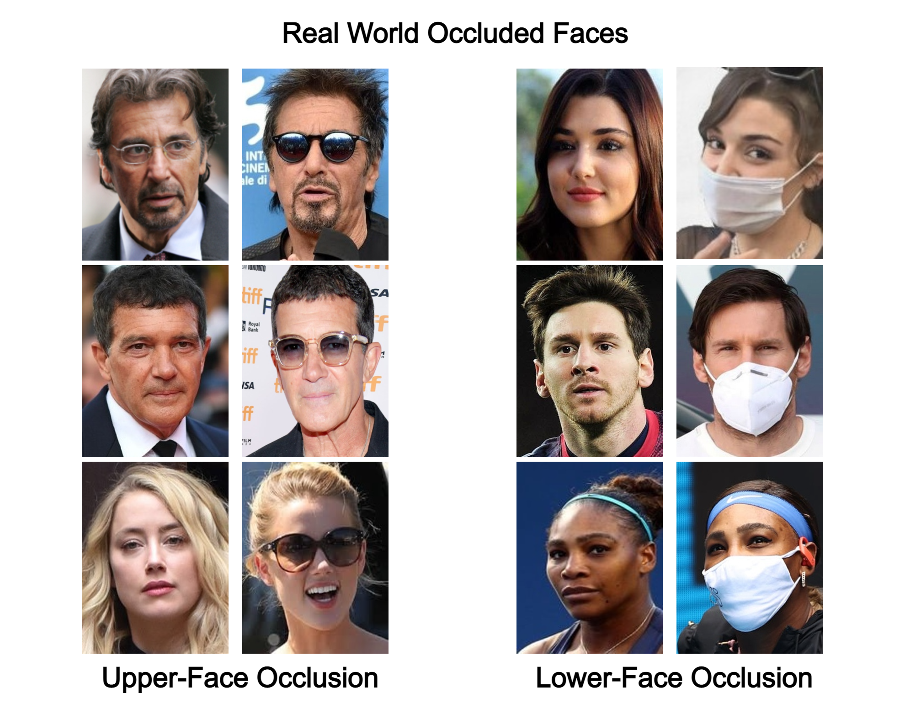

# Real World Occluded Faces (ROF)




Real World Occluded Faces (ROF) dataset contains face image samples with real life upper-face and lower-face occlusions (i.e. face masks and sunglasses). The dataset contains 3195 neutral images, 1686 sunglasses images and 678 masked images.

These images are distributed among identities as such:
- All 180 identities have neutral images.
- 70 of these identities have both types of occlusion image samples.
- 110 of these identities have only sunglasses image samples.

All of the images are from real life scenarios and have large variations in pose and illumination. Images are collected from Google Image Search using the process described in [1] with some modifications.

**`10.09.2021`**: Dataset is now available! We have included a [download.py](https://github.com/ekremerakin/RealWorldOccludedFaces/blob/main/download.py) script to obtain the jpg formated images from pickle files provided.

```bash
$ cd RealWorldOccludedFaces-main
$ python download.py
```

# Pre-processing
For face detection combination of MTCNN and RetinaFace is used. The bounding boxes are extanded by a factor of 0.3 to include the whole head as described in [1].

# Citation
If you find Real World Occluded Faces dataset useful and used in your reasearch, please consider citing the following paper:

```bash
@inproceedings{erakiotan2021recognizing,
  title={On Recognizing Occluded Faces in the Wild},
  author={Erak$\iota$n, Mustafa Ekrem and Demir, U{\u{g}}ur and Ekenel, Haz$\iota$m Kemal},
  booktitle={2021 International Conference of the Biometrics Special Interest Group (BIOSIG)},
  pages={1--5},
  year={2021},
  organization={IEEE}
}
```

## References
[1] Cao, Q., Shen, L., Xie, W., Parkhi, O. M., & Zisserman, A. (2018, May). Vggface2: A dataset for recognising faces across pose and age. In 2018 13th IEEE international conference on automatic face & gesture recognition (FG 2018) (pp. 67-74). IEEE.
